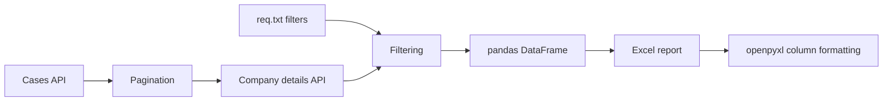

# rauapi — сбор данных о банкротствах компаний


ETL-утилита для получения активных дел о банкротстве компаний с портала ФНС, загрузки подробной информации, применения настраиваемых фильтров и экспорта результата в Excel.

## Обзор

Скрипт обрабатывает дела о банкротстве за последние семь дней. Для каждой даты он загружает список активных дел с пагинацией, оставляет записи по компаниям, запрашивает подробные данные, применяет правила из `req.txt` и формирует отформатированный `.xlsx`-отчёт.


## Возможности

- загрузка активных дел за заданный период;
- обход страниц API по 100 записей;
- отдельный запрос подробной информации о каждой компании;
- извлечение вложенных регистрационных и финансовых показателей;
- минимальные и максимальные ограничения из конфигурации;
- списки исключаемых значений;
- повторные попытки при сетевых и API-ошибках;
- объединение данных через pandas;
- экспорт в Excel с настройкой ширины столбцов.

## Поля отчёта

В итоговый файл входят:

- GUID дела, дата начала процедуры и регион;
- краткое и полное наименование компании;
- ОГРН, ИНН, КПП и код ОКВЭД;
- адрес регистрации;
- средняя численность сотрудников;
- баланс, выручка и уставный капитал;
- основные средства, запасы и дебиторская задолженность;
- налоговые платежи;
- оценочная стоимость бизнеса и ликвидационная стоимость;
- показатели платёжеспособности и потребности в оборотном капитале.

Наличие отдельных значений зависит от ответа исходного API.

## Настройка фильтров

Файл `req.txt` содержит два раздела, разделённых пустой строкой.

### Числовые требования

```text
параметр минимум максимум
```

Значение `-1` отключает соответствующую границу.

```text
balanceTotal 500000000 -1
revenue 100000000 2000000000
```

### Исключаемые значения

```text
параметр значение1 значение2 значение3
```

```text
regionCode 05 06 07 09 15 20 26
```

Пример оставляет компании с балансом от 500 миллионов и исключает перечисленные коды регионов.

## Установка

```bash
git clone https://github.com/VoskovschukDM/rauapi.git
cd rauapi

python -m venv .venv
```

Активация окружения:

```bash
# Linux / macOS
source .venv/bin/activate

# Windows PowerShell
.venv\Scripts\Activate.ps1
```

Установка зависимостей:

```bash
pip install -r requirements.txt
```

## Использование

1. Настройте правила в `req.txt`.
2. Запустите программу:

```bash
python main.py
```

Отчёт будет создан в каталоге проекта. Имя содержит обработанный период:

```text
01-09-2025to07-09-2025.xlsx
```

## Структура проекта

```text
rauapi/
├── main.py              # Сбор, преобразование и экспорт данных
├── req.txt              # Требования и списки исключений
├── requirements.txt     # Зависимости
└── README.md
```

## Реализация

- `requests` используется для запросов к API списка и подробных данных;
- `pandas` формирует и объединяет табличные данные;
- `openpyxl` настраивает созданную книгу Excel;
- при ошибке обработка каждой даты повторяется до десяти раз;
- период по умолчанию задаётся переменной `days` в `main.py`.

## Что демонстрирует проект

- интеграцию с внешним API;
- пагинацию и обработку вложенного JSON;
- конфигурируемую фильтрацию;
- ETL-преобразование данных в табличный формат;
- автоматическое создание Excel-отчёта;
- базовую устойчивость к сетевым ошибкам.

## Ограничения

Приложение зависит от внешнего публичного портала. Адреса методов, структура ответа и доступность сервиса могут измениться. Результат является выгрузкой данных, а не юридической или финансовой рекомендацией.

## Возможные улучшения

- CLI-параметры для дат, пути вывода и количества повторов;
- структурированное логирование и переиспользование HTTP-сессии;
- валидация схемы ответа API;
- тесты с моками HTTP-запросов;
- обезличенный пример отчёта и скриншоты;
- публикация готовых релизов для пользователей без Python.

# rauapi — Company Bankruptcy Data Collector


A small ETL utility that retrieves active company bankruptcy cases from the Russian Federal Tax Service bankruptcy portal, enriches them with detailed company data, applies configurable filters, and exports the result to Excel.

## Overview

The script processes bankruptcy cases for the latest seven days. For every date it requests a paginated list of active cases, keeps company records, loads detailed information for each case, filters the resulting dataset according to `req.txt`, and generates a formatted `.xlsx` report.



## Features

- collection of active bankruptcy cases for a date range;
- pagination through API responses in batches of 100 records;
- additional request for detailed company information;
- extraction of nested financial and registration fields;
- configurable minimum and maximum numeric requirements;
- configurable exclusion lists;
- retry loop for temporary network or API errors;
- aggregation with pandas;
- Excel export with normalized column widths.

## Exported fields

The report includes identifiers, company details and financial indicators such as:

- case GUID, initiation date and region;
- short and full company name;
- OGRN, INN, KPP and OKVED code;
- registration address;
- average headcount;
- balance total, revenue and authorized capital;
- fixed assets, inventory and receivables;
- tax payments;
- estimated business and liquidation values;
- solvency and working-capital indicators.

The exact availability of individual values depends on the source API response.

## Filter configuration

`req.txt` contains two sections separated by an empty line.

### Numeric requirements

```text
parameter minimum maximum
```

Use `-1` to disable a boundary.

```text
balanceTotal 500000000 -1
revenue 100000000 2000000000
```

### Excluded values

```text
parameter value1 value2 value3
```

```text
regionCode 05 06 07 09 15 20 26
```

This example keeps companies with a balance of at least 500 million and excludes the listed region codes.

## Installation

```bash
git clone https://github.com/VoskovschukDM/rauapi.git
cd rauapi

python -m venv .venv
```

Activate the environment:

```bash
# Linux / macOS
source .venv/bin/activate

# Windows PowerShell
.venv\Scripts\Activate.ps1
```

Install dependencies:

```bash
pip install -r requirements.txt
```

## Usage

1. Configure filters in `req.txt`.
2. Run the collector:

```bash
python main.py
```

The report is created in the project directory. Its name contains the processed period:

```text
01-09-2025to07-09-2025.xlsx
```

## Project structure

```text
rauapi/
├── main.py              # API collection, transformation and Excel export
├── req.txt              # Requirements and exclusion rules
├── requirements.txt     # Python dependencies
└── README.md
```

## Implementation details

- `requests` performs HTTP calls to the list and detail endpoints;
- `pandas` builds and combines tabular data;
- `openpyxl` post-processes the generated workbook;
- failed daily requests are retried up to ten times with a short delay;
- the default reporting period is controlled by the `days` variable in `main.py`.

## Engineering highlights

This project demonstrates:

- integration with a real external API;
- pagination and nested JSON parsing;
- configurable data filtering;
- ETL-style transformation into a tabular model;
- automated generation and formatting of Excel reports;
- basic fault tolerance for unstable network requests.

## Limitations

The application depends on an external public portal. Endpoints, response fields or availability may change. Use the exported data as a collection result, not as legal or financial advice.

## Possible improvements

- command-line options for dates, output path and retry count;
- structured logging and request-session reuse;
- schema validation for API responses;
- unit tests with mocked HTTP responses;
- sample anonymized report and screenshots;
- packaged releases for users without Python.
